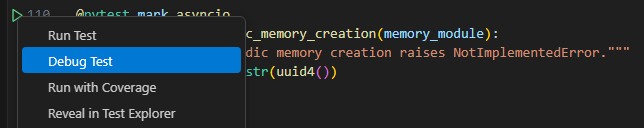

# Teams Tech Support Agent (Memory) Accelerator Template - Python

## Directory

As the maintainer of this project, please make a few updates:

## TODO

- Improving this README.MD file to provide a great experience
- Updating SUPPORT.MD with content about this project's support experience
- Understanding the security reporting process in SECURITY.MD
- Remove this section from the README

## Getting Started

### Prerequisites
Note: Ensure uv version is >= 0.4.27
Install [uv](https://docs.astral.sh/uv/getting-started/installation/)
### Installing

1. `uv sync` - it installs the virtual env and dependencies
    - If you are using Windows, you may need to manually install [cargo](https://doc.rust-lang.org/cargo/getting-started/installation.html)
2. Activate virtual env

- Mac: `source .venv/bin/activate`
- Windows: `.venv\Scripts\Activate`

3. Install pre-commit hooks

- `pre-commit install`

### Debug with test cases

#### Connect with LLM service

Under root folder, create `.env` and put LLM configurations into it.  
Note: for azure models, please add `azure/` prefix.

```
AZURE_OPENAI_API_KEY=<API key>
AZURE_OPENAI_DEPLOYMENT=azure/gpt-4o
AZURE_OPENAI_EMBEDDING_DEPLOYMENT=azure/text-embedding-3-small
AZURE_OPENAI_API_BASE=https://<domain name>.openai.azure.com
AZURE_OPENAI_API_VERSION=<version name>
```

#### Run all test cases
`pytest`

**Debug selected test**:  
For test cases marked with `@pytest.mark.asyncio`, find the play icon left to it. Right click and choose `Debug test`.



### Test Running

Mac: `PYTHONPATH=$PYTHONPATH:. pytest tests/test_memory_module.py`  
Window: `$env:PYTHONPATH = "$env:PYTHONPATH;."; pytest tests/test_memory_module.py`

## Run with test bot
Please refer to src/README.md for more details.

## Contributing

This project welcomes contributions and suggestions. Most contributions require you to agree to a Contributor License Agreement (CLA) declaring that you have the right to, and actually do, grant us the rights to use your contribution.

See [CONTRIBUTING.md](/.github/CONTRIBUTING.md) for more information.

## Code of Conduct

This repo's Code of Conduct file can be found at [CODE_OF_CONDUCT.md](/.github/CODE_OF_CONDUCT.md).

## Support

Please see the [SUPPORT.md](/.github/SUPPORT.md) file for information on how to get help with this project.

## Security

Please see the [SECURITY.md](/.github/SECURITY.md) file for information on reporting security vulnerabilities.

## Trademarks

This project may contain trademarks or logos for projects, products, or services. Authorized use of Microsoft
trademarks or logos is subject to and must follow
[Microsoft's Trademark & Brand Guidelines](https://www.microsoft.com/en-us/legal/intellectualproperty/trademarks/usage/general).
Use of Microsoft trademarks or logos in modified versions of this project must not cause confusion or imply Microsoft sponsorship.
Any use of third-party trademarks or logos are subject to those third-party's policies.
