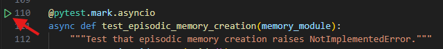

# Teams Agent Accelerator - Python

## Directory

- [Teams Agent Accelerator - Python](https://github.com/microsoft/teams-agent-accelerator-libs-py)

## Getting Started

### Prerequisites

Note: Ensure uv version is >= 0.4.27
Install [uv](https://docs.astral.sh/uv/getting-started/installation/)

### Installing

1. `uv sync` - it installs the virtual env and dependencies
    - If you are using Windows, you may need to manually install [cargo](https://doc.rust-lang.org/cargo/getting-started/installation.html)
2. Activate virtual env

- Mac: `source .venv/bin/activate`
- Windows: `.venv\Scripts\Activate`

> **Note:** After initial setup, you'll need to activate the virtual environment each time you start a new terminal session

3. Install pre-commit hooks

First install pre-commit & set up hooks:
```bash
pip install pre-commit
pre-commit install
```

### Debug with test cases

#### Connect with LLM service

Under root folder, create `.env` and put LLM configurations into it.  
Note: for azure models, please add `azure/` prefix.

```
AZURE_OPENAI_API_KEY=<API key>
AZURE_OPENAI_DEPLOYMENT=azure/gpt-4o
AZURE_OPENAI_EMBEDDING_DEPLOYMENT=azure/text-embedding-3-small
AZURE_OPENAI_API_BASE=https://<domain name>.openai.azure.com
AZURE_OPENAI_API_VERSION=<version name>
```

#### Run all test cases

**Remove overrided model string**:  
`pytest`

**Debug selected test**:  
For test cases marked with `@pytest.mark.asyncio`, find the play icon left to it. Right click and choose `Debug test`.



### Test Running

Mac: `PYTHONPATH=$PYTHONPATH:. pytest tests/test_memory_module.py`  
Window: `$env:PYTHONPATH = "$env:PYTHONPATH;."; pytest tests/test_memory_module.py`

## Run with test bot
Please refer to src/README.md for more details.

## Contributing

This project welcomes contributions and suggestions. Most contributions require you to agree to a Contributor License Agreement (CLA) declaring that you have the right to, and actually do, grant us the rights to use your contribution.

See [CONTRIBUTING.md](/.github/CONTRIBUTING.md) for more information.

## License

This repo is licensed under the MIT License. It includes tools to use APIs provided by third parties. These APIs are provided under their own separate terms. See [LICENSE.md](/.github/LICENSE.md) for more information.

- OpenAI API. Use of the OpenAI API requires an API key, which can be obtained from OpenAI. By using this SDK, you agree to abide by the OpenAI API Terms of Use and Privacy Policy. You can find them at [OpenAI Terms of Use](https://openai.com/policies/terms-of-use)
- Azure OpenAI Service. Use of the Azure OpenAI API requires an API key. By using this SDK, you agree to abide by the Azure OpenAI API terms. You can find them at [Azure OPENAI TOS](https://www.microsoft.com/licensing/terms/productoffering/MicrosoftAzure/MCA#ServiceSpecificTerms), and associated documentation at [Azure Cognitive Services](https://learn.microsoft.com/en-us/azure/cognitive-services/openai/).


## Code of Conduct

This repo's Code of Conduct file can be found at [CODE_OF_CONDUCT.md](/.github/CODE_OF_CONDUCT.md).

## Support

Please see the [SUPPORT.md](/.github/SUPPORT.md) file for information on how to get help with this project.

## Security

Please see the [SECURITY.md](/.github/SECURITY.md) file for information on reporting security vulnerabilities.

## Trademarks

This project may contain trademarks or logos for projects, products, or services. Authorized use of Microsoft
trademarks or logos is subject to and must follow
[Microsoft's Trademark & Brand Guidelines](https://www.microsoft.com/en-us/legal/intellectualproperty/trademarks/usage/general).
Use of Microsoft trademarks or logos in modified versions of this project must not cause confusion or imply Microsoft sponsorship.
Any use of third-party trademarks or logos are subject to those third-party's policies.
