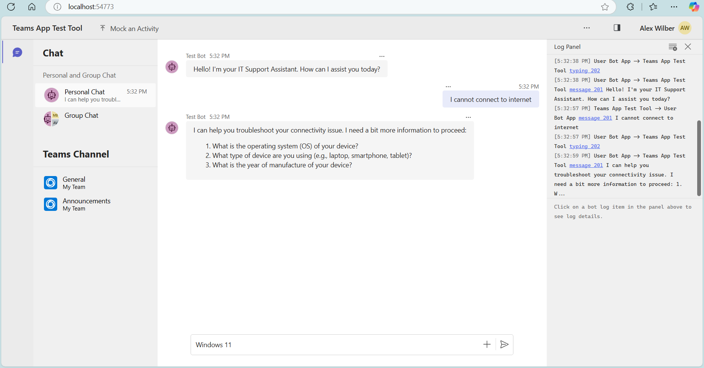

# Overview of the Basic AI Chatbot template

This app template is built on top of [Teams AI library](https://aka.ms/teams-ai-library) and [Teams Memory Agent]().
This template showcases a bot app that responds to user questions like an AI assistant. This enables your users to talk with the AI assistant in Teams to find information.

## Get started with the template

> **Prerequisites**
>
> To run the template in your local dev machine, you will need:
>
> - [Python](https://www.python.org/), version 3.8 to 3.11.
> - [Python extension](https://code.visualstudio.com/docs/languages/python), version v2024.0.1 or higher.
> - [Teams Toolkit Visual Studio Code Extension](https://aka.ms/teams-toolkit) latest version or [Teams Toolkit CLI](https://aka.ms/teams-toolkit-cli).
> - An account with [OpenAI](https://platform.openai.com/).
> - [Node.js](https://nodejs.org/) (supported versions: 16, 18) for local debug in Test Tool.

### Configurations

1. create _.env_ in root folder. Copy the below template into it.

```
# AZURE CONFIG

AZURE_OPENAI_API_KEY=<API key>
AZURE_OPENAI_DEPLOYMENT=gpt-4o
AZURE_OPENAI_EMBEDDING_DEPLOYMENT=text-embedding-3-small
AZURE_OPENAI_API_BASE=https://<domain name>.openai.azure.com
AZURE_OPENAI_API_VERSION=<version number>

# OPENAI CONFIG

OPENAI_MODEL_NAME=gpt-4o
OPENAI_API_KEY=<API key>
OPENAI_EMBEDDING_MODEL_NAME=text-embedding-3-small
```

Fill out only one of Azure OpenAI and OpenAI configurations.

### Debug with Teams Test Tool

1. Open a new terminal under root folder.
1. run `npm install -g @microsoft/teamsapp-cli`
1. run `uv sync`
1. run `.venv\Scripts\Activate`
1. run `python src/app.py`  
   If success, server will start on `http://localhost:3978`
1. Open another new Terminal under root folder
1. Install the teams app test tool (if you haven't already done that)
   - run `mkdir -p src/devTool/teamsapptester` (or `New-Item -ItemType Directory -Path src/devTool/teamsapptester -Force` on Powershell)
   - run `npm i @microsoft/teams-app-test-tool --prefix "src/devTools/teamsapptester"`
1. run `node src/devTools/teamsapptester/node_modules/@microsoft/teams-app-test-tool/cli.js start`  
   If success, a test website will show up
   

### Debug in Teams

1. Open a new terminal under root folder.
1. run `uv sync`
1. run `.venv\Scripts\Activate`
1. Open this folder as a VSCode workspace.
1. Navigate to the `Run and Debug` tab in VSCode, and select `Debug in Teams (Edge)`. This will start the flow to sideload the bot into Teams, start the server locally, and start the tunnel that exposes the server to the web.

### Deploy to Azure

Currently the scaffolding only supports Azure OpenAI related configurations but can be easily update to support OpenAI configuration.

1. Open a new terminal under root folder.
1. run `uv sync`
1. run `.venv\Scripts\Activate`
1. Build the memory module into a distribtuion file by doing `uv build packages/teams_memory`. This should create the artifact `dist/teams_memory-0.1.0.tar.gz`. Copy this into the `src/dist/` folder.
1. Open this folder as a VSCode workspace.
1. Copy the contents of the `.env` file and add it to the `env/.env.dev.user` file.
1. Navigate to the Teams Toolkit extension in VSCode.
1. Under `Lifecycle`, first click `Provision` to provision resources to Azure.
1. Then click `Deploy`, this should deploy the project to the Azure App Service instance, and run the start up script.
1. If the above two steps completed successfully, then click `Publish`. This will create an app package in `./appPackage/build/appPackage.dev.zip`.
1. Sideload the app package in Teams and start chatting with the bot.

**Congratulations**! You are running an application that can now interact with users in Teams:

> For local debugging using Teams Toolkit CLI, you need to do some extra steps described in [Set up your Teams Toolkit CLI for local debugging](https://aka.ms/teamsfx-cli-debugging).


## What's included in the template

| Folder       | Contents                                     |
| ------------ | -------------------------------------------- |
| `.vscode`    | VSCode files for debugging                   |
| `appPackage` | Templates for the Teams application manifest |
| `infra`      | Templates for provisioning Azure resources   |
| `src`        | The source code for the application          |

The following files can be customized and demonstrate an example implementation to get you started.

| File                            | Contents                                               |
| ------------------------------- | ------------------------------------------------------ |
| `src/app.py`                    | Hosts an aiohttp api server and exports an app module. |
| `src/bot.py`                    | Handles business logics for the Basic AI Chatbot.      |
| `src/config.py`                 | Defines the environment variables.                     |
| `src/prompts/chat/skprompt.txt` | Defines the prompt.                                    |
| `src/prompts/chat/config.json`  | Configures the prompt.                                 |

The following are Teams Toolkit specific project files. You can [visit a complete guide on Github](https://github.com/OfficeDev/TeamsFx/wiki/Teams-Toolkit-Visual-Studio-Code-v5-Guide#overview) to understand how Teams Toolkit works.

| File                    | Contents                                                                                                                                  |
| ----------------------- | ----------------------------------------------------------------------------------------------------------------------------------------- |
| `teamsapp.yml`          | This is the main Teams Toolkit project file. The project file defines two primary things: Properties and configuration Stage definitions. |
| `teamsapp.local.yml`    | This overrides `teamsapp.yml` with actions that enable local execution and debugging.                                                     |
| `teamsapp.testtool.yml` | This overrides `teamsapp.yml` with actions that enable local execution and debugging in Teams App Test Tool.                              |

## Extend the template

You can follow [Build a Basic AI Chatbot in Teams](https://aka.ms/teamsfx-basic-ai-chatbot) to extend the Basic AI Chatbot template with more AI capabilities, like:

- [Customize prompt](https://aka.ms/teamsfx-basic-ai-chatbot#customize-prompt)
- [Customize user input](https://aka.ms/teamsfx-basic-ai-chatbot#customize-user-input)
- [Customize conversation history](https://aka.ms/teamsfx-basic-ai-chatbot#customize-conversation-history)
- [Customize model type](https://aka.ms/teamsfx-basic-ai-chatbot#customize-model-type)
- [Customize model parameters](https://aka.ms/teamsfx-basic-ai-chatbot#customize-model-parameters)
- [Handle messages with image](https://aka.ms/teamsfx-basic-ai-chatbot#handle-messages-with-image)

## Additional information and references

- [Teams Toolkit Documentations](https://docs.microsoft.com/microsoftteams/platform/toolkit/teams-toolkit-fundamentals)
- [Teams Toolkit CLI](https://aka.ms/teamsfx-toolkit-cli)
- [Teams Toolkit Samples](https://github.com/OfficeDev/TeamsFx-Samples)

## Known issue

- If you use `Debug in Test Tool` to local debug, you might get an error `InternalServiceError: connect ECONNREFUSED 127.0.0.1:3978` in Test Tool log. You can wait for Python launch console ready and then refresh the front end web page.
- When you use `Launch Remote in Teams` to remote debug after deployment, you might loose interaction with your bot. This is because the remote service needs to restart. Please wait for several minutes to retry it.
